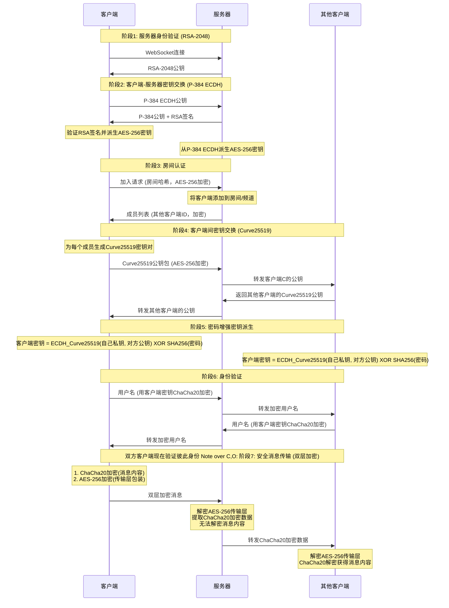

# NodeCrypt

🌐 **[English README](README_EN.md)**

## 🚀 部署说明

### 一键部署到 Cloudflare Workers

点击下方按钮即可一键部署到 Cloudflare Workers：

- 构建命令：npm run build
- 部署命令：npm run deploy

#### 启用「消息留存」所需的存储资源（可选）

不使用留存功能时可以跳过。`wrangler.toml` 中已内置 `DB`（D1）与 `HISTORY_BLOB`（R2）两个绑定和一个每分钟触发的定时清理任务，其中 **D1 库刻意不写 `database_id`**，部署时由 wrangler 的自动资源供给特性自动创建并绑定（要求 wrangler ≥ 4.45.0，本仓库已锁 `^4.136.3`），不需要在本地跑 `wrangler d1 create`。若删掉这两段绑定，客户端与 Worker 都会自动降级为「不存储」，实时聊天不受任何影响。

首次部署成功后，还需要各做一次：

1. **建 R2 桶**：Cloudflare 面板 → Storage & Databases → R2 → Create bucket，名字填 `nodecrypt-history-blobs`。R2 不会被自动创建（自动供给只覆盖 D1），而 wrangler 在部署时就会校验桶是否存在，缺失会以 `code 10085` 让部署直接失败——**必须先建桶，否则部署不通过**。桶名不需要任何 id。
2. **建表**：面板 → Storage & Databases → D1 → `nodecrypt-history` → Console，把 `worker/migrations/0001_history.sql` 的内容粘进去执行。beta 阶段 wrangler 不会把自动生成的库 ID 回写到 `.toml`，所以 `wrangler d1 migrations apply` 在 CI 里用不了，只能这样建表；文件里的语句均为 `IF NOT EXISTS`，重复执行无害。

> 若你在面板上手动建了 D1 库，也可以把它的 UUID 填回 `wrangler.toml` 的 `database_id`，两种方式等效。

## 📝 项目简介

NodeCrypt 是一个真正的端到端加密聊天系统，实现完全的零知识架构。整个系统设计确保服务器、网络中间人、甚至系统管理员都无法获取任何明文消息内容。所有加密和解密操作都在客户端本地进行，服务器仅作为加密数据的盲中继。

### 系统架构
- **前端**：ES6+ 模块化 JavaScript，无框架依赖
- **后端**：Cloudflare Workers + Durable Objects
- **通信**：WebSocket 实时双向通信
- **构建**：Vite 现代化构建工具
- **存储（可选）**：D1（消息索引与密文）+ R2（图片等大记录），仅在开启「消息留存」时使用；Docker / 自托管部署使用进程内存，重启即清空

## 🔐 零知识架构设计

### 核心原则
- **服务器盲转**：服务器永远无法解密消息内容，仅负责加密数据中转
- **默认无持久化**：默认状态下系统不使用任何持久化存储，所有数据仅在内存中临时存在（可选择开启有限时长的消息留存，见下文，开启后服务器仍只能接触密文）
- **端到端加密**：消息从发送方到接收方全程加密，中间任何环节都无法解密
- **前向安全性**：即使密钥泄露，也无法解密历史消息，因为默认根本就没有历史消息
- **匿名通信**：用户无需注册真实身份，支持临时匿名聊天
- **多样体验**：和批量发送图片和文件，可选择主题和语言。

### 隐私保护机制

- **实时成员提醒**：房间在线列表完全透明，内任何人加入或离开都会实时通知所有成员，
- **无历史消息**：默认情况下新加入的用户无法看到任何历史聊天记录
- **私聊加密**：点击用户头像可发起端到端加密的私密对话，房间内其他成员完全无法看到私聊内容

### 消息留存（可选，默认关闭）

默认行为与以前完全一致：所有人离开后消息即消失。若需要跨会话保留一段时间，可在加入房间时设置**留存时长**（0 或 1～1440 分钟，即最长 24 小时，分辨率为 1 分钟）。

- **写入时机**：记录先在服务器内存中缓冲，**当房间内最后一个人退出时才批量写入数据库**。其他人单独退出不会触发写入。
- **能读到什么**：因为写入发生在房间清空时，**正在聊天的人看不到上一次会话的历史**；历史会在房间空掉之后、且仍在留存窗口内时，对重新进入的人可见。
- **密钥来源**：历史密钥由**房间密码**派生（`PBKDF2-SHA256(SHA256(密码), salt=SHA256(房间名), 310000 次)`），密码只在客户端参与计算，服务器永远拿不到，因此**服务器无法解密任何留存内容**
- **必须设置房间密码**：无密码时没有服务器不知道的熵源，留存会被禁用并强制为 0
- **房主管理密码**：加入时可选填。第一个创建房间的人用表单里的时长作为初始值；**此后只有能提供正确管理密码的人（房主）可以修改留存时长**。管理密码不会被保存到任何地方，也不会上传到服务器（服务器只保存由它派生出的验证值，无法反推），所以换设备重新输入同一个管理密码即可继续作为房主
- **设为 0 会立即清除**：房主把留存改成 0 时，该房间已保存的全部历史（含 R2 中的大对象）会被立刻删除
- **只能加密文本与图片**：大文件分卷不属于留存范围；单条记录过大时只影响留存，实时传输照常
- **私聊不参与留存**：私聊使用每次会话现生成的临时密钥，设计上不支持历史回放
- **认证加密**：留存记录使用 AES-256-GCM（含完整性校验），而非直播消息所用的 AES-CBC / ChaCha20
- **自动清理**：服务器每分钟清理一次过期数据，R2 中的大对象一并删除

> ⚠️ 开启留存会削弱「根本不存在历史消息」这一原有保证：在留存窗口内，任何拿到房间密码的人（以及拿到数据库副本并成功爆破弱密码的攻击者）都能还原这段历史。请使用强房间密码，并在不需要时保持 0。

### 房间密码机制

房间密码作为**密钥派生因子**参与端到端加密：`最终共享密钥 = ECDH_共享密钥 XOR SHA256(房间密码)`

- **密码错误隔离**：不同密码的房间无法解密彼此的消息
- **服务器盲区**：服务器永远无法获知房间密码

### 三层安全体系

#### 第一层：RSA-2048 服务器身份验证
- 服务器启动时生成临时 RSA-2048 密钥对，每24小时自动轮换
- 客户端连接时验证服务器公钥，防止中间人攻击
- 私钥仅在服务器内存中存在，从不持久化存储

#### 第二层：ECDH-P384 密钥协商
- 每个客户端生成独立的椭圆曲线密钥对（P-384曲线）
- 通过椭圆曲线 Diffie-Hellman 密钥交换协议建立共享密钥
- 每个客户端与服务器之间拥有独立的加密通道

#### 第三层：混合对称加密
- **服务器通信**：使用 AES-256-CBC 加密客户端与服务器间的控制消息
- **客户端通信**：使用 ChaCha20 加密客户端之间的实际聊天内容
- 每条消息使用独立的初始化向量（IV）和随机数（Nonce）

## 🔄 完整加密流程详解

## 🛠️ 技术实现

- **Web Cryptography API**：浏览器原生加密实现，提供硬件加速
- **elliptic.js**：椭圆曲线密码学库，实现 Curve25519 和 P-384
- **aes-js**：纯 JavaScript AES 实现，支持多种模式
- **js-chacha20**：ChaCha20 流加密算法的 JavaScript 实现
- **js-sha256**：SHA-256 哈希算法实现

## 🔬 安全验证

### 加密过程验证
用户可通过浏览器开发者工具观察完整的加密解密过程，验证消息在传输过程中确实处于加密状态。

### 网络流量分析
使用网络抓包工具可以验证所有 WebSocket 传输的数据都是不可读的加密内容。

### 代码安全审计
所有加密相关代码完全开源，使用标准密码学算法，欢迎安全研究者进行独立审计。

## ⚠️ 安全建议

- **使用强房间密码**：房间密码直接影响端到端加密强度，建议使用复杂密码
- **密码保密性**：房间密码一旦泄露，该房间所有通信内容都可能被解密
- **使用最新版本的现代浏览器**：确保密码学API的安全性和性能

## 🤝 安全贡献

欢迎安全研究者报告漏洞和进行安全审计。严重安全问题将在24小时内修复。

## 📄 开源协议

本项目采用 ISC 开源协议。

## ⚠️ 免责声明

本项目仅供学习和技术研究使用，不得用于任何违法犯罪活动。使用者应遵守所在国家和地区的相关法律法规。项目作者不承担因使用本软件而产生的任何法律责任。请在合法合规的前提下使用本项目。

---
## Star History

**NodeCrypt** - 真正的端到端加密通信 🔐

*"在数字时代，加密是保护隐私的最后一道防线"*
